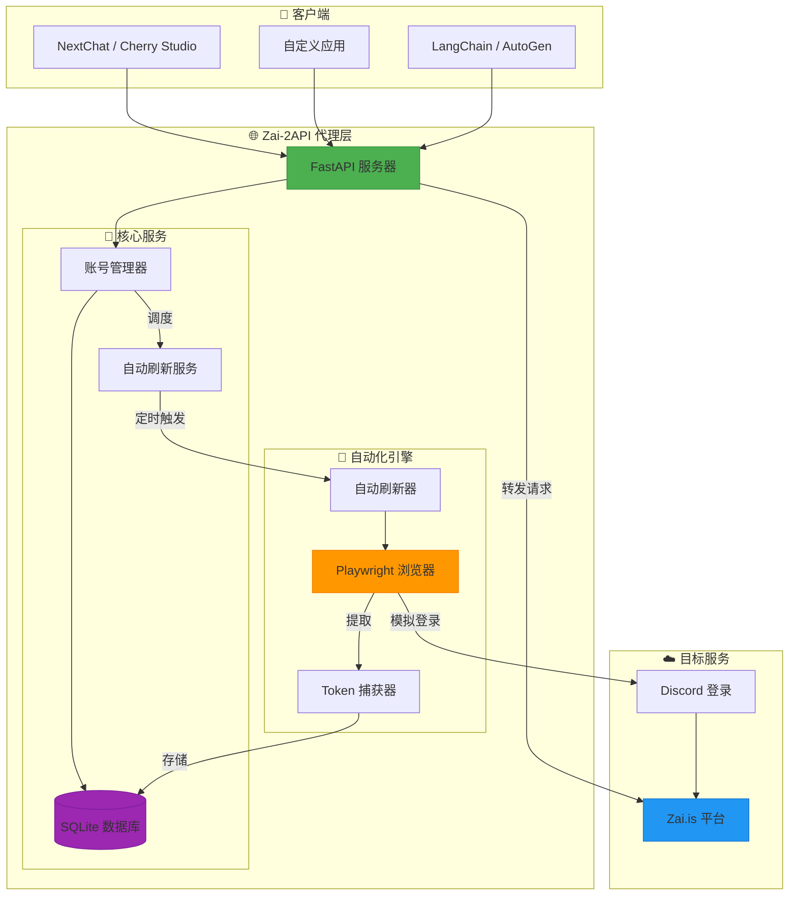
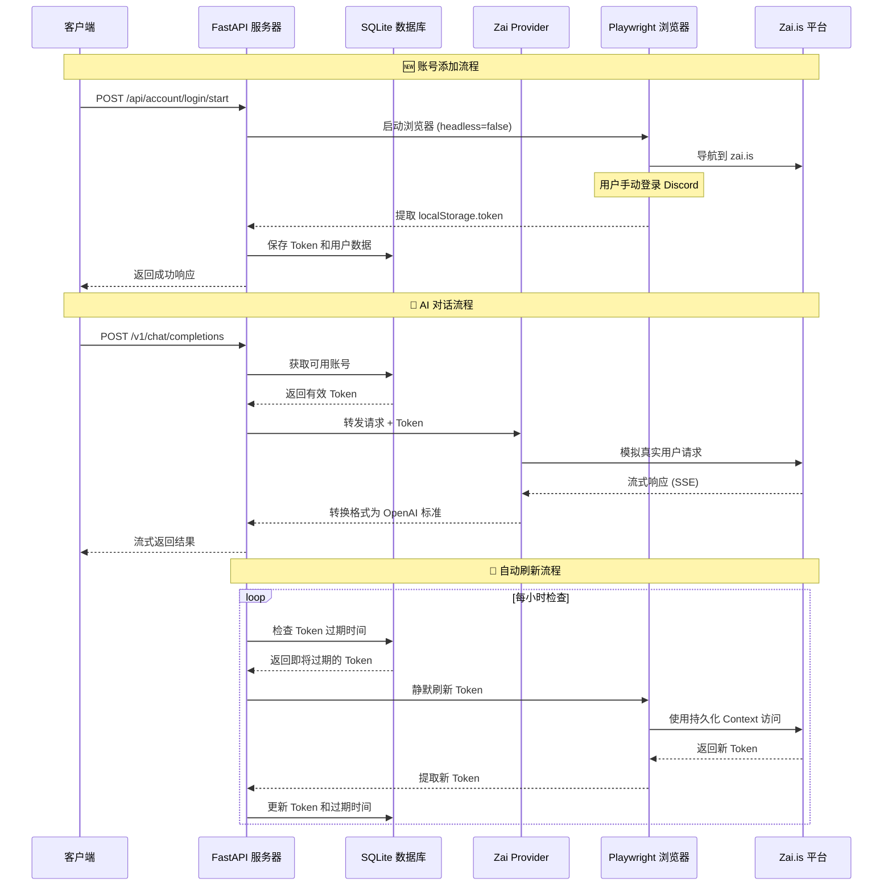
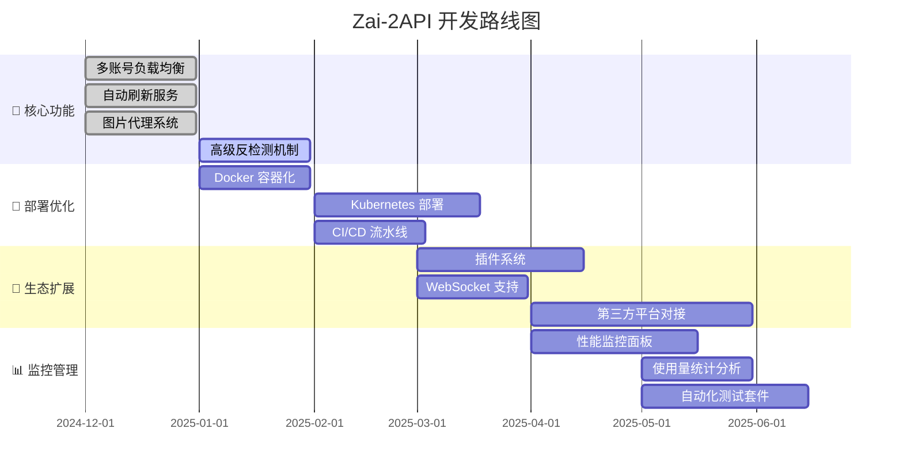

# 🚀 Zai-2API: 解锁 Zai.is 的无限潜能 (Python版)

[](https://www.python.org/)
[](https://fastapi.tiangolo.com/)
[](https://playwright.dev/)
[](https://platform.openai.com/)
[](https://opensource.org/licenses/Apache-2.0)

> **🌐 GitHub 仓库**: [https://github.com/lza6/zai.is-2api-python](https://github.com/lza6/zai.is-2api-python)
> **🚀 Hugging Face Space**: [点击部署](https://huggingface.co/new-space?template=lza6/zai.is-2api-python)

---

## 🌟 核心特性

<div align="center">

| 🔄 自动刷新 | 🛡️ 高级伪装 | 💾 持久化存储 | 🖼️ 智能图片处理 |
|------------|------------|--------------|----------------|
| Token 自动保活 | 绕过人机验证 | 登录状态持久化 | Base64 图片转换 |
| 7×24 小时运行 | 消除自动化指纹 | Cookie 本地存储 | 跨域代理支持 |

</div>

---

## 📖 序言：技术、自由与开源精神

你好，探索者！👋

当你打开这份文档，你不仅仅是在查看代码，而是在接触一种 **"打破技术壁垒"** 的理念。Zai-2API 的诞生源于一个朴素的愿望：**让强大的 AI 模型触手可及，让技术红利惠及每一个人。**

在这个项目中，我们不生产 AI，我们是 AI 的 **"桥梁建造者"**。利用现代化的浏览器自动化技术，我们将 Zai.is 优秀的 Web 体验转化为开发者熟悉的 API 接口。

这不仅仅是一个工具，这是一次关于 **逆向工程、自动化与系统架构** 的有趣实践。希望你在使用中感受到代码带来的纯粹快乐——那种"我来，我见，我征服"的成就感。✨

---

## 🏗️ 系统架构



---

## 🚀 快速开始 (5 分钟部署)

### 🌐 部署方式一：Hugging Face Space (推荐，零配置)

[](https://huggingface.co/spaces)

1. 点击 [**在 Hugging Face Space 上部署**](https://huggingface.co/new-space?template=lza6/zai.is-2api-python)
2. 选择一个 Space 名称（例如 `my-zai-api`）
3. 点击 "Create Space" 开始部署
4. 等待约 2-3 分钟，部署完成后即可使用

> ✅ **优点**: 无需本地安装、自动更新、免费使用、高可用性

---

### 🏠 部署方式二：本地运行 (传统方式)

### 1️⃣ 环境准备
确保你的系统已安装 **Python 3.9+**：
```bash
python --version
# Python 3.11.0 或更高版本
```

### 2️⃣ 获取项目
**方法 A：Git 克隆（推荐）**
```bash
git clone https://github.com/lza6/zai.is-2api-python.git
cd zai.is-2api-python
```

**方法 B：直接下载**
1. 访问 [GitHub 仓库](https://github.com/lza6/zai.is-2api-python)
2. 点击 `Code` → `Download ZIP`
3. 解压到本地目录

### 3️⃣ 一键安装
在项目根目录运行：
```bash
# 安装 Python 依赖
pip install -r requirements.txt

# 安装 Playwright 浏览器内核
playwright install chromium
```

### 4️⃣ 启动服务
**Windows 用户：**
- 双击 `start.bat` 文件
- 或命令行运行：`python main.py`

**macOS/Linux 用户：**
```bash
python main.py
```

### 5️⃣ 首次配置
1. 打开浏览器访问：`http://localhost:8000`
2. 点击 **"🌐 启动浏览器登录"** 按钮
3. 在弹出的浏览器窗口中完成 Discord 登录
4. 登录成功后关闭浏览器，Token 自动保存
5. 现在可以开始使用 API 了！🎉

---

## 📊 技术架构详解

### 🧩 核心组件说明

| 组件 | 技术栈 | 职责 | 关键技术点 |
|------|--------|------|------------|
| **Web 服务层** | FastAPI + Uvicorn | 提供 HTTP API 接口 | OpenAI 兼容接口、SSE 流式响应 |
| **自动化层** | Playwright + Chromium | 浏览器自动化操作 | 持久化 Context、反检测技术 |
| **数据层** | SQLite + 线程锁 | 状态存储与管理 | 线程安全操作、ACID 事务 |
| **业务层** | 自定义管理器 | 账号、Token、图片管理 | 自动刷新、负载均衡、缓存清理 |

### 🔄 工作流程


### 🛡️ 反检测技术实现
```python
# 关键反检测配置
context = await browser.new_context(
    viewport={'width': 1920, 'height': 1080},
    user_agent='Mozilla/5.0 (Windows NT 10.0; Win64; x64) AppleWebKit/537.36',
    # 移除自动化特征
    bypass_csp=True,
    ignore_https_errors=True,
    java_script_enabled=True,
    has_touch=False,
    is_mobile=False,
    extra_http_headers={
        'Accept-Language': 'zh-CN,zh;q=0.9,en;q=0.8',
        'Sec-Ch-Ua': '"Not_A Brand";v="8", "Chromium";v="120"',
    }
)

# 注入脚本消除 WebDriver 特征
await page.add_init_script("""
    Object.defineProperty(navigator, 'webdriver', { get: () => undefined });
    window.chrome = { runtime: {} };
    Object.defineProperty(navigator, 'plugins', {
        get: () => [1, 2, 3, 4, 5]
    });
""")
```

---

## 🔧 详细配置指南

### 📁 目录结构说明
```
zai-2api/
├── 📁 accounts_data/     # 浏览器用户数据（自动生成）
│   ├── acc_20250101_120000/
│   │   └── browser_data/  # Playwright 持久化数据
│   └── ...
├── 📁 app/               # 应用核心代码
│   ├── 📁 core/          # 核心模块
│   │   ├── config.py     # 配置管理
│   │   └── db_manager.py # 数据库管理（单例模式）
│   ├── 📁 providers/     # 平台提供者
│   │   └── zai_provider.py # Zai.is API 封装
│   └── 📁 utils/         # 工具类
│       ├── token_auto_refresh_service.py # 自动刷新服务
│       └── ...
├── 📁 data/              # SQLite 数据库文件
│   └── zai.db           # 主数据库
├── 📁 media/             # 图片缓存（自动清理）
├── 📁 templates/         # Web 界面模板
│   └── dashboard.html   # 控制台界面
├── .env                 # 环境变量配置
├── main.py              # FastAPI 应用入口
├── requirements.txt     # Python 依赖
└── start.bat           # Windows 启动脚本
```

### ⚙️ 环境变量配置
创建或编辑 `.env` 文件：
```ini
# === 安全配置 ===
API_MASTER_KEY=your_secret_key_here  # API 访问密钥
PORT=8000                           # 服务端口

# === 路径配置 ===
DB_PATH=data/zai.db                # 数据库路径
USER_DATA_DIR=zai_user_data        # 用户数据目录

# === 高级选项 ===
# REFRESH_INTERVAL=3600            # Token 刷新间隔（秒）
# PREVIEW_MODE=false               # 是否显示浏览器窗口
```

---

## 📡 API 接口文档

### 🤖 OpenAI 兼容接口
所有接口都遵循 **OpenAI API 规范**，可以直接对接各种 AI 客户端。

#### 对话补全
```http
POST /v1/chat/completions
Content-Type: application/json
Authorization: Bearer your_api_key

{
  "model": "gpt-5-2025-08-07",
  "messages": [
    {"role": "user", "content": "你好，请介绍一下自己"}
  ],
  "stream": true,
  "temperature": 0.7,
  "max_tokens": 1000
}
```

#### 获取模型列表
```http
GET /v1/models
```

### 🛠️ 管理接口

#### 启动浏览器登录
```http
POST /api/account/login/start
Content-Type: application/x-www-form-urlencoded

name=我的账号
```

#### 手动添加账号
```http
POST /api/account/add
Content-Type: application/x-www-form-urlencoded

name=手动账号&token=eyJhbGciOiJIUzI1NiIs...
```

#### 强制刷新所有账号
```http
POST /api/refresh/force
```

#### 获取账号状态
```http
GET /api/account/status
```

### 🖼️ 图片处理特性
当 AI 返回包含 base64 图片的响应时：
```markdown
# AI 原始响应


# 代理后响应

```

**自动处理流程：**
1. ✅ 检测 base64 图片数据
2. ✅ 解码并保存为 PNG/JPG 文件
3. ✅ 替换为本地可访问 URL
4. ✅ 30 分钟后自动清理

---

## 🎯 支持的 AI 模型

Zai-2API 支持 Zai.is 平台上的所有主流模型：

| 模型 ID | 显示名称 | 提供商 | 能力 |
|---------|----------|--------|------|
| `gpt-5-2025-08-07` | GPT-5 | OpenAI | 最新 GPT-5 模型 |
| `claude-opus-4-20250514` | Claude Opus 4 | Anthropic | 最强推理模型 |
| `claude-sonnet-4-5-20250929` | Claude Sonnet 4.5 | Anthropic | 平衡型智能助手 |
| `gemini-3-pro-image-preview` | Nano Banana Pro | Google | 多模态视觉模型 |
| `o3-pro-2025-06-10` | o3-pro | OpenAI | 推理优化版本 |
| `grok-4-1-fast-reasoning` | Grok 4.1 Fast | xAI | 快速推理版本 |
| `gemini-2.5-pro` | Gemini 2.5 Pro | Google | 专业文本处理 |
| `claude-haiku-4-5-20251001` | Claude Haiku 4.5 | Anthropic | 快速轻量级模型 |
| `o1-2024-12-17` | o1 | OpenAI | 数学推理专用 |
| `o4-mini-2025-04-16` | o4-mini | OpenAI | 轻量快速版本 |
| `grok-4-0709` | Grok 4 | xAI | 标准版本 |
| `gemini-2.5-flash-image` | Nano Banana | Google | 快速图像处理 |

---

## 🔍 故障排除

### ❌ 常见问题解决方案

| 问题 | 可能原因 | 解决方案 |
|------|----------|----------|
| **无法启动浏览器** | Playwright 未正确安装 | 运行 `playwright install chromium` |
| **登录后无法获取 Token** | Discord 登录流程变更 | 检查浏览器控制台日志，可能需要更新选择器 |
| **Token 频繁过期** | 刷新间隔设置不当 | 检查网络稳定性，调整 `REFRESH_INTERVAL` |
| **API 响应缓慢** | 网络问题或账号限制 | 使用多账号轮询，检查代理设置 |
| **图片无法显示** | 跨域问题或路径错误 | 确保客户端能访问 `http://localhost:8000/media/` |

### 📋 调试模式
启动服务时添加调试参数：
```bash
# Windows
set LOG_LEVEL=DEBUG && python main.py

# macOS/Linux
LOG_LEVEL=DEBUG python main.py
```

查看详细日志了解问题所在。

---

## 📈 性能优化建议

### 🚀 提升并发能力
1. **多账号轮询**：添加多个 Zai.is 账号，系统会自动负载均衡
2. **连接池优化**：调整 `httpx.AsyncClient` 的连接池大小
3. **缓存策略**：对频繁请求的模型信息进行缓存

### 💾 资源管理
```python
# 在 zai_provider.py 中优化连接管理
async with httpx.AsyncClient(
    timeout=120.0,
    limits=httpx.Limits(
        max_connections=100,
        max_keepalive_connections=50
    ),
    http2=True  # 启用 HTTP/2
) as client:
    # 请求代码...
```

---

## 🔮 未来发展路线图



---

## 🤝 如何贡献

我们欢迎各种形式的贡献！🎉

### 🐛 报告 Bug
1. 在 [GitHub Issues](https://github.com/lza6/zai.is-2api-python/issues) 查看是否已有相关报告
2. 创建新的 Issue，描述详细复现步骤
3. 包括：环境信息、错误日志、期望行为

### 💡 功能建议
1. 先在 Issues 中讨论想法
2. 描述使用场景和预期收益
3. 如果可以，提供原型代码或设计思路

### 🔧 提交代码
1. Fork 本仓库
2. 创建特性分支：`git checkout -b feature/amazing-feature`
3. 提交更改：`git commit -m 'Add amazing feature'`
4. 推送到分支：`git push origin feature/amazing-feature`
5. 创建 Pull Request

### 📚 改进文档
- 修正拼写错误或语法问题
- 补充使用示例
- 翻译为其他语言
- 添加图表或示意图

---

## ⚖️ 法律与道德声明

### 📜 许可证
本项目采用 **Apache License 2.0** 开源协议。

**你可以：**
- ✅ 自由使用、复制、修改本软件
- ✅ 用于个人、商业或教育目的
- ✅ 分发修改后的版本
- ✅ 申请专利授权

**你需要：**
- 📝 保留原始版权和许可声明
- ⚖️ 在修改文件中明确说明更改内容
- 📄 在分发时附带 Apache 2.0 许可证副本

### 🛡️ 道德使用指南
**请务必：**
- 🔒 仅用于合法授权的研究和学习目的
- 👥 尊重原平台的服务条款
- 📊 合理控制请求频率，避免给目标服务器造成负担
- 🤝 尊重其他用户和开发者的权益

**请勿：**
- 🚫 用于任何违法或不道德的活动
- 🚫 大规模爬取或商业滥用
- 🚫 攻击或破坏目标服务
- 🚫 侵犯他人的知识产权

### ⚠️ 免责声明
本项目仅供**技术研究和学习交流**使用。使用者应对自己的行为负全部责任。开发者不对因使用本项目而产生的任何直接或间接损失负责。

> **技术本身是中立的，但技术的使用应有边界。让我们共同维护一个健康、合法的技术生态。** 🌱

---

## 🌟 特别感谢

- **Zai.is 团队** - 提供优秀的 AI 平台
- **Playwright 社区** - 强大的浏览器自动化工具
- **FastAPI 项目** - 高性能的 Web 框架
- **所有贡献者** - 让这个项目变得更好
- **开源精神** - 代码改变世界，分享创造价值

---

## 📞 支持与交流

遇到问题或有建议？我们提供多种支持渠道：

| 渠道 | 用途 | 响应时间 |
|------|------|----------|
| [GitHub Issues](https://github.com/lza6/zai.is-2api-python/issues) | Bug 报告、功能建议 | 1-3 天 |
| GitHub Discussions | 技术讨论、使用交流 | 1-2 天 |
| 项目 Wiki | 详细文档、教程 | 持续更新 |
| Discord 社区 | 实时交流、快速帮助 | 即时 |

---

## 📊 项目统计

<div align="center">


**最后更新：** 2025年12月11日 23:00:24
**活跃状态：** 🟢 积极维护  
**推荐 Python 版本：** 3.11+

</div>

---

> **💖 Made with passion and countless cups of coffee by [lza6](https://github.com/lza6)**  
> *If this project helps you, please give it a ⭐ on GitHub!*

---

<div align="center">
  
**✨ 技术自由，始于分享 ✨**

</div>
