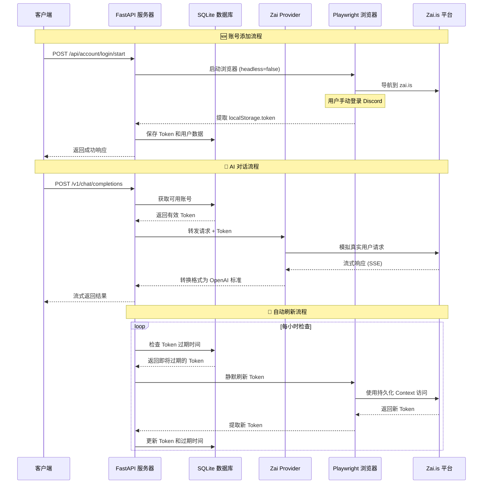

# 🚀 ZAI-2API: 解锁 Zai.is 的无限潜能 (Hugging Face Space 版)

[](https://huggingface.co/spaces)
[](https://www.python.org/)
[](https://fastapi.tiangolo.com/)
[](https://playwright.dev/)
[](https://platform.openai.com/)
[](https://opensource.org/licenses/Apache-2.0)

> **🌐 GitHub 仓库**: [https://github.com/iudd/zaihf](https://github.com/iudd/zaihf)
> **🚀 Hugging Face Space**: [点击使用](https://huggingface.co/spaces/iyougame/zaihf)

---

## 🌟 核心特性

<div align="center">

| 🔄 自动刷新 | 🛡️ 高级伪装 | 💾 持久化存储 | 🖼️ 智能图片处理 |
|------------|------------|--------------|----------------|
| Token 自动保活 | 绕过人机验证 | 登录状态持久化 | Base64 图片转换 |
| 7×24 小时运行 | 消除自动化指纹 | Cookie 本地存储 | 跨域代理支持 |

</div>

---

## 📖 序言：技术、自由与开源精神

你好，探索者！👋

当你打开这份文档，你不仅仅是在查看代码，而是在接触一种 **"打破技术壁垒"** 的理念。Zai-2API 的诞生源于一个朴素的愿望：**让强大的 AI 模型触手可及，让技术红利惠及每一个人。**

在这个项目中，我们不生产 AI，我们是 AI 的 **"桥梁建造者"**。利用现代化的浏览器自动化技术，我们将 Zai.is 优秀的 Web 体验转化为开发者熟悉的 API 接口。

这不仅仅是一个工具，这是一次关于 **逆向工程、自动化与系统架构** 的有趣实践。希望你在使用中感受到代码带来的纯粹快乐——那种"我来，我见，我征服"的成就感。✨

---

## 🏗️ 系统架构

```mermaid
graph TB
    subgraph "🔗 客户端"
        C1[NextChat / Cherry Studio]
        C2[自定义应用]
        C3[LangChain / AutoGen]
    end
    
    subgraph "🌐 Zai-2API 代理层"
        API[FastAPI 服务器]
        subgraph "🧠 核心服务"
            AM[账号管理器]
            DB[(SQLite 数据库)]
            AS[自动刷新服务]
        end
        subgraph "🤖 自动化引擎"
            PW[Playwright 浏览器]
            TC[Token 捕获器]
            AR[自动刷新器]
        end
    end
    
    subgraph "☁️ 目标服务"
        ZAI[Zai.is 平台]
        DISCORD[Discord 登录]
    end
    
    C1 --> API
    C2 --> API
    C3 --> API
    
    API --> AM
    AM --> DB
    
    AS -->|定时触发| AR
    AR --> PW
    PW -->|模拟登录| DISCORD
    DISCORD --> ZAI
    PW -->|提取| TC
    TC -->|存储| DB
    
    AM -->|调度| AS
    API -->|转发请求| ZAI
    
    style API fill:#4CAF50,stroke:#388E3C
    style PW fill:#FF9800,stroke:#F57C00
    style ZAI fill:#2196F3,stroke:#1976D2
    style DB fill:#9C27B0,stroke:#7B1FA2
```



---

## 🚀 快速开始 (Hugging Face Space)

### 1️⃣ 访问 Space

直接访问已部署的 Space：
```
https://huggingface.co/spaces/iyougame/zaihf
```

### 2️⃣ 添加 Zai.is 账号

1. 在 Space 页面中，点击 **"🌐 启动浏览器登录"** 按钮
2. 在弹出的浏览器窗口中完成 Discord 登录
3. 登录成功后关闭浏览器，Token 将自动保存

### 3️⃣ 使用 API

Space 启动后，你可以使用以下 API：

- **模型列表**: `GET /v1/models`
- **对话接口**: `POST /v1/chat/completions`
- **账号管理**: 通过 Web 界面管理多个 Zai.is 账号

---

## 🔧 API 使用示例

### Python 客户端

```python
import openai

# 配置 OpenAI 客户端指向 Hugging Face Space
client = openai.OpenAI(
    api_key="1",  # 默认密钥
    base_url="https://iyougame-zaihf.hf.space/v1"
)

# 发送聊天请求
response = client.chat.completions.create(
    model="gpt-5-2025-08-07",
    messages=[
        {"role": "user", "content": "你好，请介绍一下自己"}
    ]
)

print(response.choices[0].message.content)
```

### cURL 示例

```bash
curl -X POST "https://iyougame-zaihf.hf.space/v1/chat/completions" \
     -H "Content-Type: application/json" \
     -H "Authorization: Bearer 1" \
     -d '{
           "model": "gpt-5-2025-08-07",
           "messages": [{"role": "user", "content": "你好"}]
         }'
```

---

## 📊 技术架构详解

### 🧩 核心组件说明

| 组件 | 技术栈 | 职责 | 关键技术点 |
|------|--------|------|------------|
| **Web 服务层** | FastAPI + Uvicorn | 提供 HTTP API 接口 | OpenAI 兼容接口、SSE 流式响应 |
| **自动化层** | Playwright + Chromium | 浏览器自动化操作 | 持久化 Context、反检测技术 |
| **数据层** | SQLite + 线程锁 | 状态存储与管理 | 线程安全操作、ACID 事务 |
| **业务层** | 自定义管理器 | 账号、Token、图片管理 | 自动刷新、负载均衡、缓存清理 |

### 🔄 工作流程


---

## 📋 支持的模型

ZAI-2API 支持 Zai.is 平台上的所有主流模型：

| 模型 ID | 显示名称 | 提供商 | 能力 |
|---------|----------|--------|------|
| `gpt-5-2025-08-07` | GPT-5 | OpenAI | 最新 GPT-5 模型 |
| `claude-opus-4-20250514` | Claude Opus 4 | Anthropic | 最强推理模型 |
| `claude-sonnet-4-5-20250929` | Claude Sonnet 4.5 | Anthropic | 平衡型智能助手 |
| `gemini-3-pro-image-preview` | Nano Banana Pro | Google | 多模态视觉模型 |
| `o3-pro-2025-06-10` | o3-pro | OpenAI | 推理优化版本 |
| `grok-4-1-fast-reasoning` | Grok 4.1 Fast | xAI | 快速推理版本 |
| `gemini-2.5-pro` | Gemini 2.5 Pro | Google | 专业文本处理 |
| `claude-haiku-4-5-20251001` | Claude Haiku 4.5 | Anthropic | 快速轻量级模型 |
| `o1-2024-12-17` | o1 | OpenAI | 数学推理专用 |
| `o4-mini-2025-04-16` | o4-mini | OpenAI | 轻量快速版本 |
| `grok-4-0709` | Grok 4 | xAI | 标准版本 |
| `gemini-2.5-flash-image` | Nano Banana | Google | 快速图像处理 |

---

## 🔍 故障排除

### ❌ 常见问题解决方案

| 问题 | 可能原因 | 解决方案 |
|------|----------|----------|
| **无法启动浏览器** | Playwright 未正确安装 | Space 已自动安装，如仍有问题请等待重启 |
| **登录后无法获取 Token** | Discord 登录流程变更 | 检查浏览器控制台日志，可能需要更新选择器 |
| **Token 频繁过期** | 刷新间隔设置不当 | 检查网络稳定性，系统会自动刷新 |
| **API 响应缓慢** | 网络问题或账号限制 | 使用多账号轮询，检查代理设置 |
| **图片无法显示** | 跨域问题或路径错误 | 确保客户端能访问 Space 的 /media/ 路径 |

---

## 🚨 注意事项

### 使用限制

1. **账号有效性**: 必须使用有效的 Zai.is 账号
2. **请求频率**: 避免过高频率请求，防止账号被封
3. **资源限制**: Hugging Face Space 有计算资源限制
4. **数据隐私**: 请勿发送敏感信息

### 常见问题

**Q: 浏览器登录失败怎么办？**
A: 确保浏览器能够正常访问 zai.is，并完成 Discord 验证。

**Q: Token 频繁过期？**
A: 系统会自动刷新，但请确保网络连接稳定。

**Q: API 响应缓慢？**
A: 可以添加多个账号实现负载均衡，提高响应速度。

---

## 📞 技术支持

- **项目主页**: [GitHub 仓库](https://github.com/iudd/zaihf)
- **问题反馈**: [GitHub Issues](https://github.com/iudd/zaihf/issues)
- **Hugging Face Space**: [Space 主页](https://huggingface.co/spaces/iyougame/zaihf)

---

## ⚖️ 免责声明

本项目仅供技术研究和学习交流使用。使用者应对自己的行为负全部责任。开发者不对因使用本项目而产生的任何直接或间接损失负责。

> **技术本身是中立的，但技术的使用应有边界。让我们共同维护一个健康、合法的技术生态。** 🌱

---

## 🌟 特别感谢

感谢以下开源项目和社区的支持：

- **Hugging Face** - 提供 Spaces 平台
- **FastAPI** - 高性能 Web 框架
- **Playwright** - 浏览器自动化工具
- **Zai.is** - 提供优质的 AI 服务

---

**最后更新**: 2025年12月23日  
**版本**: 2.0.0 (Hugging Face Space)